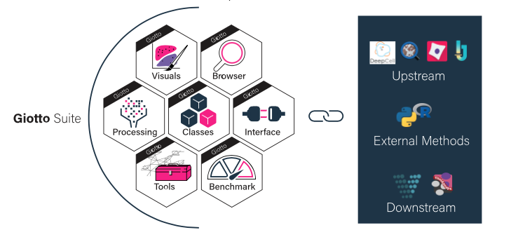

##########################################
Giotto Suite
##########################################

.. toctree::
   :maxdepth: 2
   :caption: General
   :hidden:
 
   Getting Started <gettingstarted.rst> 
   Documentation <documentation.rst>
   Contribute <contribute.rst> 

.. toctree::
   :maxdepth: 2
   :caption: Guides
   :hidden:

   Tutorials <datasets.rst> 
   FAQs <faqs> 
   Try Giotto <trygiotto.rst>
   
.. toctree::
   :maxdepth: 2
   :caption: Issues
   :hidden:
   
   Common Errors and Solutions <errorsfaqsandtips.rst>
   Report a Bug <github_issues.rst>

Giotto Suite is a collection of open source software tools, including data structures and methods, for the comprehensive analysis and visualization of spatial multi-omics data at multiple scales and resolutions. It extends and improves our previous R package `Giotto`_. The underlying framework of Giotto Suite is generalizable to virtually all current and emerging spatial technologies which may differ in resolution (e.g. subcellular, single cell, or multiple cells), spatial dimension (i.e. 2D vs. 3D), molecular modality (e.g. protein, RNA, DNA, …), and throughput (i.e. number of cells and analytes). Giotto Suite is designed to ensure spatial analysis solutions remain compatible with current and future spatial -omics technologies and platforms. It will also aid in the further integration of spatial -omics with external analysis pipelines and tools.

See `NEWS <news>`_ for more details.

.. _Giotto: https://genomebiology.biomedcentral.com/articles/10.1186/s13059-021-02286-2

**********************************************
Workflow
**********************************************
:octicon:`light-bulb` Click on the images for full resolution.

.. image:: images/index/input_Compatibility.png
   :width: 600

Data Structure 
===============

.. image:: images/index/data_structure_Data_Structure.png
   :width: 600

Analysis
=============

.. image:: images/index/analysis.png
   :width: 400

More technical information can be found in the `detailed workflow section <detailed_workflow>`_.

References 
=============

* `Dries, R., Zhu, Q. et al. Giotto, a toolbox for integrative analysis and visualization of spatial expression data. Genome Biology (2021). <https://genomebiology.biomedcentral.com/articles/10.1186/s13059-021-02286-2>`_
* `Dries, R., Chen, J., Rossi, N. del, Khan, M.M., Sistig, A., Yuan, G.-C., 2021. Advances in spatial transcriptomic data analysis. Genome Res. 31, 1706–1718 <https://genome.cshlp.org/content/31/10/1706?top=1>`_

**********************************
Cite Giotto 
**********************************

:ref:`Citing Giotto <citing_giotto>`

*******************************
License
*******************************
:doc:`Full License </subsections/license>`

.. github-shield:: 
    :username: RubD
    :repository: Giotto
    :branch: suite
    :license: 

*******************************
Community
*******************************

:doc:`Code of Conduct <subsections/code_of_conduct>`

****************************
Authors and Developers 
****************************

+------------------------+---------------------+
|`Ruben Dries`_          |*Author, Maintainer* | 
+------------------------+---------------------+
| Jiaji George Chen      |*Author*             |
+------------------------+---------------------+
| Natalie Del Rossi      |*Author*             |
+------------------------+---------------------+
| Emma Kelley            |*Author*             |
+------------------------+---------------------+
| Junxiang Xu            |*Author*             |
+------------------------+---------------------+
| Guo-Cheng Yuan         |*Author*             |
+------------------------+---------------------+
| Joselyn Chávez         |*Author*             |
+------------------------+---------------------+
| Adriana Sistig         |*Author*             |
+------------------------+---------------------+
| Matthew O'Brien        |*Author*             |
+------------------------+---------------------+
| `Edward C. Ruiz`_      |*Author*             |
+------------------------+---------------------+

.. _Ruben Dries: https://www.drieslab.com
.. _Edward C. Ruiz: https://twitter.com/ziuron

